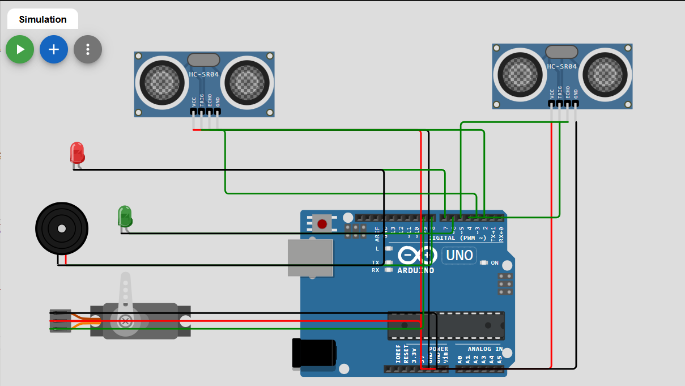
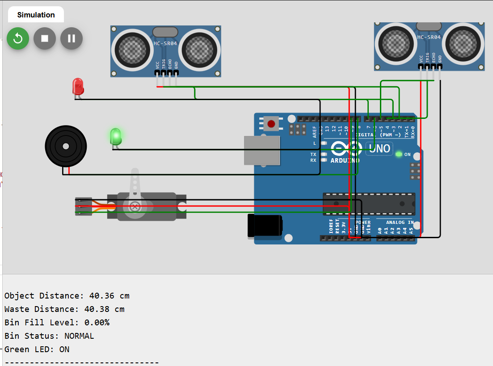
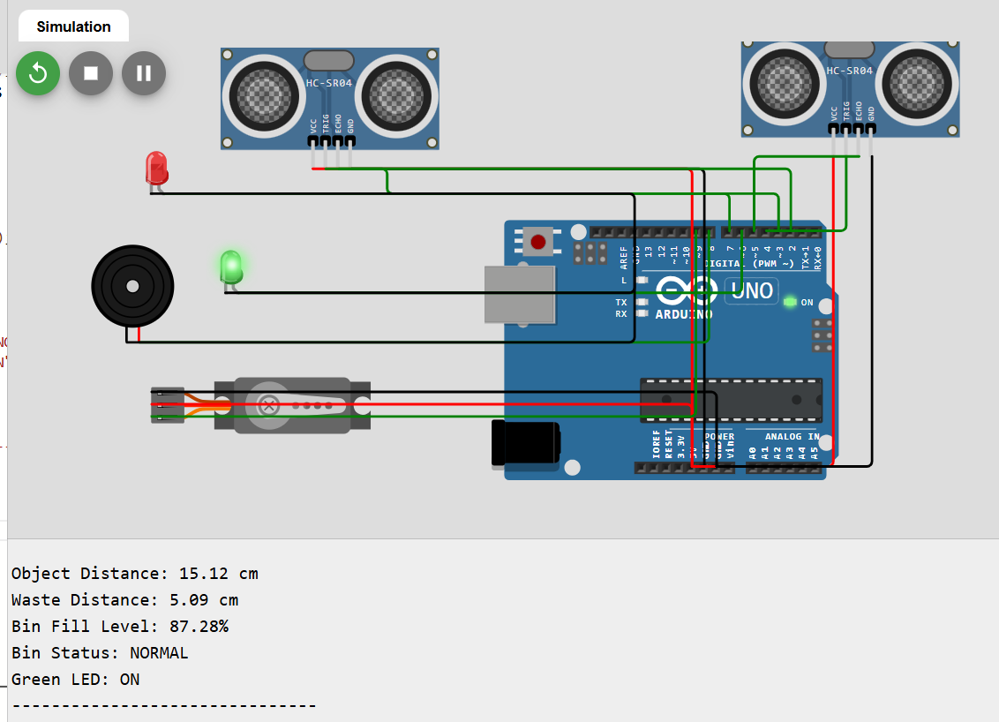
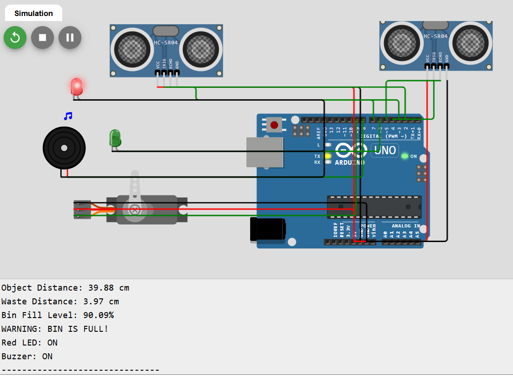
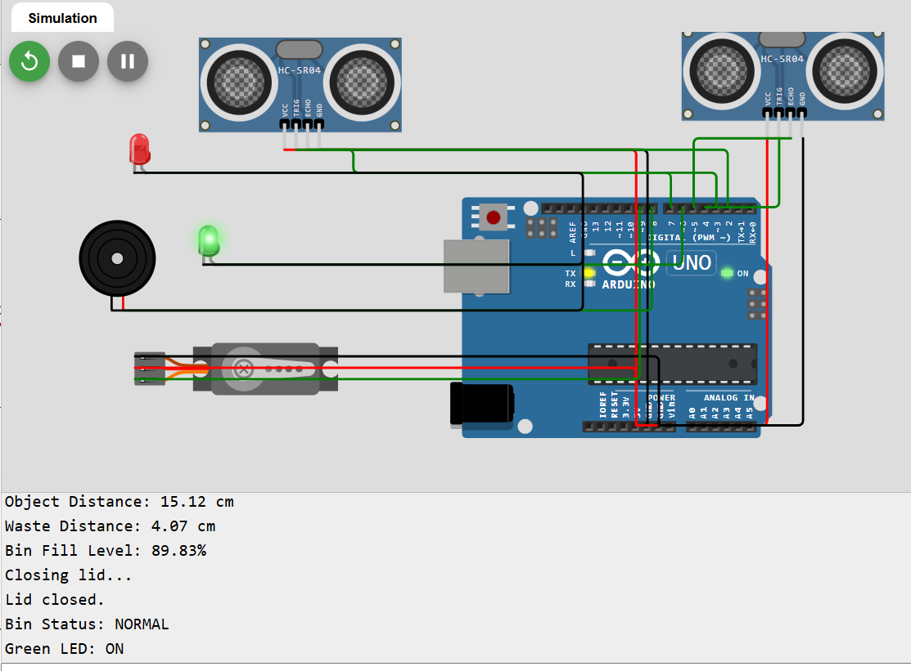

# 🚮 Smart Dustbin – Industry-Oriented Embedded System

An embedded systems project that demonstrates an automated smart dustbin using an Arduino UNO, ultrasonic sensors, a servo motor, LEDs, and a buzzer.

The system automatically opens the dustbin lid when an object is detected and monitors the waste level. When the bin reaches the configured full threshold, the system activates a red LED and buzzer alert.

---

## 📌 Project Overview

Traditional dustbins require users to touch the lid and waste collection staff to manually check whether a bin is full.

This project demonstrates a simple embedded-system solution for these problems.

The Smart Dustbin:

- Detects a hand or object near the dustbin
- Automatically opens the lid
- Automatically closes the lid after a short delay
- Measures the waste level
- Calculates approximate bin fill percentage
- Indicates normal bin status using a green LED
- Indicates a full bin using a red LED
- Activates a buzzer when the bin reaches the full threshold
- Displays sensor readings through the Serial Monitor

The complete system was developed and tested virtually using Wokwi.

---

# 🎯 Problem Statement

Manual dustbin monitoring can lead to:

- Overflowing waste
- Unnecessary manual inspection
- Poor hygiene
- Delayed waste collection
- Increased maintenance effort

The Smart Dustbin demonstrates how sensors and a microcontroller can automate basic waste monitoring and user interaction.

---

# 💡 Objectives

The main objectives of this project are:

1. Detect objects approaching the dustbin.
2. Automatically control the dustbin lid.
3. Measure the amount of available space in the bin.
4. Calculate approximate waste fill percentage.
5. Detect when the bin reaches the full threshold.
6. Provide visual and audio alerts.
7. Demonstrate embedded-system concepts through simulation.

---

# ⚙️ Features

- Automatic lid opening
- Automatic lid closing
- Ultrasonic distance measurement
- Waste-level monitoring
- Fill percentage calculation
- Green LED for normal status
- Red LED for full-bin status
- Buzzer alert
- Serial Monitor output
- Arduino-based control
- Virtual simulation using Wokwi

---

# 🏗️ System Architecture

```text
              SMART DUSTBIN
                   │
          ┌────────┴────────┐
          │                 │
          ▼                 ▼
      Ultrasonic         Ultrasonic
       Sensor 1           Sensor 2
          │                 │
          │                 │
   Hand/Object         Waste Level
     Detection          Detection
          │                 │
          ▼                 ▼
       Arduino UNO ─── Fill Calculation
          │                 │
          │          ┌──────┴──────┐
          │          │             │
          │        Normal        Full
          │          │             │
          ▼          ▼             ▼
       Servo      Green LED     Red LED
          │                       +
          ▼                    Buzzer
      Lid Control
```

---

# 🔌 Hardware Components

| Component | Purpose |
|---|---|
| Arduino UNO | Main microcontroller |
| HC-SR04 Ultrasonic Sensor 1 | Detects approaching hand/object |
| HC-SR04 Ultrasonic Sensor 2 | Measures waste level |
| Servo Motor | Controls dustbin lid |
| Green LED | Indicates normal bin status |
| Red LED | Indicates full-bin status |
| Buzzer | Provides full-bin alert |
| Breadboard | Circuit prototyping |
| Jumper Wires | Electrical connections |

---

# 🔧 Pin Configuration

| Component | Arduino Pin |
|---|---|
| Sensor 1 TRIG | D2 |
| Sensor 1 ECHO | D3 |
| Sensor 2 TRIG | D4 |
| Sensor 2 ECHO | D5 |
| Green LED | D6 |
| Red LED | D7 |
| Buzzer | D8 |
| Servo Signal | D9 |

---

# 🧠 Embedded System Concepts Used

## Microcontroller

Arduino UNO acts as the central controller.

It receives sensor inputs, processes the readings, and controls the outputs.

## GPIO

Digital input/output pins are used to communicate with sensors, LEDs, buzzer, and servo control.

## Ultrasonic Sensor

The HC-SR04 measures distance using ultrasonic waves.

The distance measurement is used for:

- Object detection
- Waste-level monitoring

## Servo Motor

The servo controls the dustbin lid.

The project uses approximately:

```text
0°  → Lid Closed
90° → Lid Open
```

## PWM

The servo is controlled using a PWM-based control signal.

## Threshold Logic

The system uses thresholds to make decisions.

Example:

```text
Object distance ≤ 20 cm
        ↓
Lid opens
```

and:

```text
Bin fill ≥ 90%
        ↓
Full-bin alert
```

## Sensor Calibration

The project uses a known simulated bin height of:

```text
40 cm
```

The measured distance is converted into an approximate fill percentage.

---

# 📐 Bin-Level Calculation

The project uses the following formula:

```text
Fill Level = Bin Height - Measured Distance
```

Then:

```text
Fill Percentage =
(Fill Level / Bin Height) × 100
```

For this simulation:

```text
Bin Height = 40 cm
```

### Example

If the sensor measures:

```text
20 cm
```

Then:

```text
Fill Level = 40 - 20
           = 20 cm
```

Therefore:

```text
Fill Percentage =
(20 / 40) × 100
= 50%
```

---

# 📊 Example Fill Levels

| Waste Distance | Approx. Fill Level |
|---:|---:|
| 40 cm | 0% |
| 30 cm | 25% |
| 20 cm | 50% |
| 10 cm | 75% |
| 4 cm | 90% |
| 0 cm | 100% |

The full-bin alert threshold used in this project is:

```text
90%
```

---

# 🔄 System Workflow

```text
Start
  ↓
Initialize sensors and outputs
  ↓
Read object distance
  ↓
Object within 20 cm?
  │
  ├── Yes → Open lid
  │          ↓
  │        Wait
  │          ↓
  │        Close lid
  │
  └── No → Keep lid closed
  ↓
Read waste distance
  ↓
Calculate fill percentage
  ↓
Fill ≥ 90%?
  │
  ├── Yes → Red LED + Buzzer
  │
  └── No → Green LED
  ↓
Repeat
```

---

# 🧪 Testing

The project was tested using the Wokwi virtual simulation environment.

| Test | Input | Expected Result | Status |
|---|---|---|---|
| Empty bin | Sensor 2 ≈ 40 cm | 0%, Green LED | PASS |
| Half-full | Sensor 2 ≈ 20 cm | 50%, Green LED | PASS |
| Full alert | Sensor 2 ≈ 4 cm | 90%, Red LED + Buzzer | PASS |
| Object detection | Sensor 1 ≈ 15 cm | Lid opens | PASS |
| Lid closing | 3 second delay | Lid closes | PASS |
| Complete system | Sensor 1 ≈ 15 cm, Sensor 2 ≈ 4 cm | Lid + alert system | PASS |

---

# 🖥️ Simulation

## Simulation Platform

**Wokwi**

The project was developed and tested virtually because physical hardware was not required for the initial implementation.

The simulation contains:

- Arduino UNO
- Two ultrasonic sensors
- Servo motor
- Green LED
- Red LED
- Buzzer

---

# 📸 Screenshots

## Circuit Diagram



## Empty Bin



## Automatic Lid



## Full Bin Alert



## Complete System Test



---

# 📁 Project Structure

```text
Smart-Dustbin-Embedded-System/
│
├── arduino_code/
│   ├── automatic_lid_test.ino
│   ├── alert_test.ino
│   └── smart_dustbin_final.ino
│   ├── bin_fill_test.ino
│   └── bin_level_test.ino
│   ├── servo_test.ino
│   └── ultrasonic_test.ino
│
├── circuit_diagram/
│   └── circuit_diagram.png
│
├── data/
│   └── test_results.md
│
├── screenshots/
│   ├── empty_bin.png
│   ├── lid_open.png
│   ├── full_bin_alert.png
│   └── complete_system_test.png
│
├── simulation/
│
├── docs/
│   └── simulation.md
│
└── README.md
```

---

# ▶️ How to Run

## Virtual Simulation

1. Open the Wokwi project.
2. Ensure the Arduino UNO and required components are connected.
3. Ensure `Servo` is available in the Wokwi project libraries.
4. Open `sketch.ino`.
5. Start the simulation.
6. Open the Serial Monitor.
7. Change Sensor 1 distance to simulate object detection.
8. Change Sensor 2 distance to simulate different waste levels.
9. Observe the servo, LEDs, buzzer, and Serial Monitor.

---

# 💻 Source Code

The main integrated program is available here:

```text
arduino_code/smart_dustbin_final.ino
```

The project also contains smaller test programs used during development.

---

# 🏭 Industry Relevance

Smart waste-management systems can help organizations monitor waste collection requirements and reduce unnecessary manual inspection.

Potential applications include:

- Smart cities
- Hospitals
- Airports
- Railway stations
- Shopping malls
- Office buildings
- Educational campuses
- Industrial facilities
- Public sanitation systems

Potential benefits include:

- Touchless operation
- Improved hygiene
- Reduced overflow
- Easier monitoring
- Better maintenance planning
- Improved collection efficiency

This project demonstrates the basic embedded-system principles that can form part of larger IoT-based waste-management systems.

---

# 🚀 Future Improvements

Possible future versions could include:

- ESP32-based implementation
- Wi-Fi connectivity
- Cloud-based monitoring
- Mobile notifications
- OLED/LCD display
- Multiple smart bins
- Central monitoring dashboard
- Battery/solar power
- Real-time waste collection monitoring
- Remote sensor diagnostics
- IoT-based collection optimization

---

# 🎓 Learning Outcomes

Through this project, I practiced:

- Arduino programming
- Embedded C concepts
- GPIO control
- Ultrasonic sensor interfacing
- Servo motor control
- Distance measurement
- Threshold-based decision making
- Sensor data processing
- LED and buzzer control
- Embedded system integration
- Virtual circuit simulation
- Testing and debugging
- Git and GitHub project management
- Technical documentation

---

# 👩‍💻 Author

**Shikha**

MCA Student  
Cybersecurity & Embedded Systems Learner

---

# 📌 Project Status

**Status: Completed — Virtual Simulation**

The complete Smart Dustbin system was successfully implemented and tested using Wokwi.

Physical hardware implementation can be performed as a future extension of the project.
